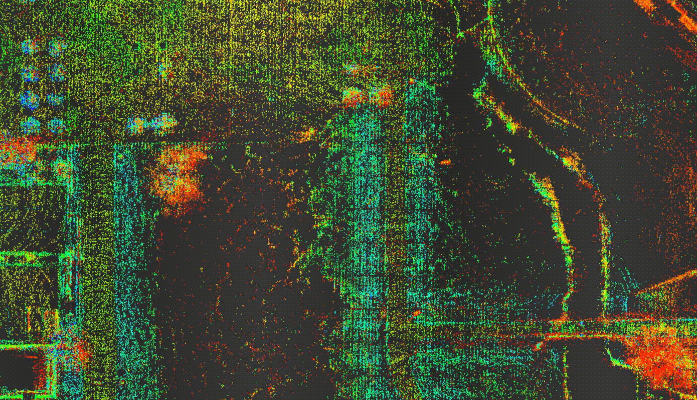

# pointcloud_extractor_ros


[](https://opensource.org/licenses/MIT)

ROS package for pointcloud extraction

The extracted pointcloud is saved to `~/.ros/cloud_filtered.pcd`

<p align="center">
  
</p>

## Environment
- Ubuntu 20.04
- ROS Noetic

## Install and Build
```
# clone repository
cd /path/to/your/catkin_ws/src
git clone https://github.com/ToshikiNakamura0412/pointcloud_extractor_ros.git

# build
cd /path/to/your/catkin_ws
rosdep install -riy --from-paths src --rosdistro noetic          # Install dependencies
catkin build pointcloud_extractor_ros -DCMAKE_BUILD_TYPE=Release # Release build is recommended
```

## How to use
```
roslaunch pointcloud_extractor_ros pointcloud_extractor.launch
```

## Nodes
### pointcloud_extractor
#### Published Topics
- /cloud_filtered (`sensor_msgs/PointCloud2`)
  - The extracted pointcloud

#### Subscribed Topics
- /cloud_pcd (`sensor_msgs/PointCloud2`)
  - The input pointcloud
- /move_base_simple/goal (`geometry_msgs/PoseStamped`)
  - The pose for extracting pointcloud

#### Parameters
- ~\<name>/<b>max_z</b> (float, default: `100.0` [m]):<br>
  - The max z value for filtering
- ~\<name>/<b>min_z</b> (float, default: `-100.0` [m]):<br>
  - The min z value for filtering
